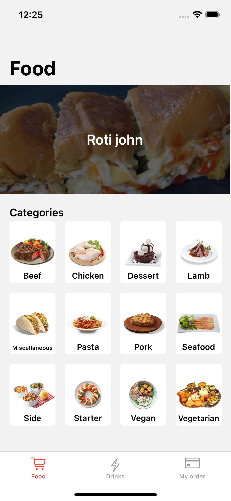
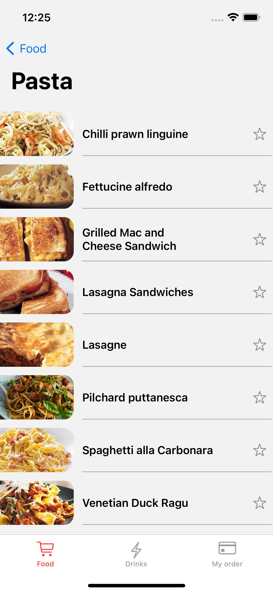
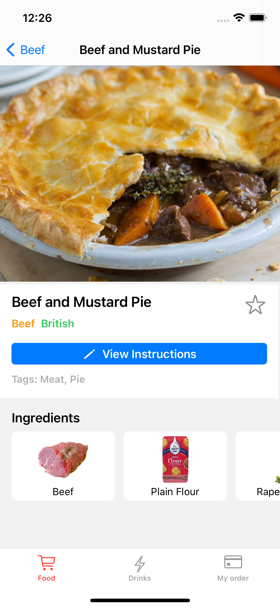
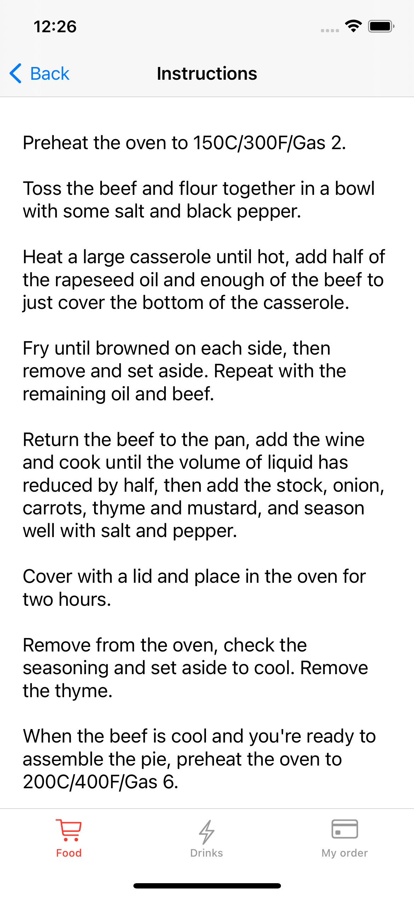

## Foodlink

An iOS application for listing and viewing meal options. 

**Built with Xcode, Swift 5 and powered by TheMealDB API.**

#### Features: 
* Viewing recipes, categories and meal instructions
* Searching for recipes 
* Saving recipes to quickly view later. 

#### Technologies used: 
* UIKit 
* CollectionView CompositionalLayout APIs
* DiffableDataSource APIs
* ViewModel Integration (MVVM)
* Networking with API calls
* Caching Images 
* Programmatic UI

#### Sample Screens 

    
    
     
    
    

